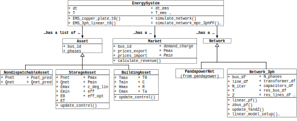
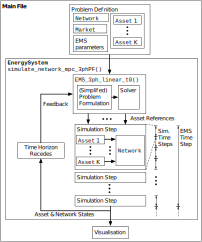

Overview
=============

Oxford University's Energy and Power Group's Open Platform for Energy Networks (OPEN) provides a python toolset for modelling, simulation and optimisation of smart local energy systems.
The framework combines distributed energy resource modelling (e.g. for PV generation sources, battery energy storage systems, electric vehicles), energy market modelling, power flow simulation and multi-period optimisation for scheduling flexible energy resources.

OPEN and the methods used are presented in detail in the following publication:

T. Morstyn, K. Collett, A. Vijay, M. Deakin, S. Wheeler, S. M. Bhagavathy, F. Fele and M. D. McCulloch; *"An Open-Source Platform for Developing Smart Local Energy System Applications”*; University of Oxford Working Paper, 2019

Installation
-------------

Download OPEN source code `here <https://github.com/EPGOxford/OPEN/>`_.

If using conda, we suggest creating a new virtual environment from the requirements.txt file.
First, add the following channels to your conda distribution if not already present:

.. code:: bash

  conda config --add channels invenia
  conda config --add channels picos
  conda config --add channels conda_forge

To create the new virtual environment, run:

.. code:: bash

  conda create --name <env_name> --file requirements.txt python=3.6

Getting started
----------------

The simplest way to start is to duplicate one of the case study main.py files:
- OxEMF_EV_case_study_v6.py
- Main_building_casestudy.py

Dependencies
------------

* `Pandas <https://pandas.pydata.org/>`_
* `scipy <https://www.scipy.org/>`_
* `cvxopt <https://cvxopt.org/>`_
* `scikit-learn <https://scikit-learn.org/stable/>`_
* `Pandapower <https://pandapower.readthedocs.io/en/v1.6.0/>`_
* `Numpy <http://www.numpy.org/>`_
* `Picos = 1.1.2 <https://picos-api.gitlab.io/picos/>`_
* `Matplotlib <https://matplotlib.org/>`_
* `numba <http://numba.pydata.org/numba-doc/latest/index.html/>`_
* `requests <http://docs.python-requests.org/en/master/>`_

Platform Structure
--------------------

OPEN is implemented in Python using an object orientated programming approach, with the aim of providing modularity, code reuse and extensibility.
Fig. 1 shows a universal modelling language (UML) class diagram of OPEN. OPEN has four important base classes: Asset, Network, Market and EnergySystem.

**Fig. 1 - UML class diagram of OPEN, showing the main classes, attributes and methods.**

OPEN includes two energy management system (EMS) methods for controllable Asset objects:
(i) one for multi-period optimisation with a simple ‘copper plate’ network model, and
(ii) the other for multi-period optimisation with a linear multi-phase distribution network model which includes voltage and current flow constraints.
OPEN has simulation methods for:
(i) open-loop optimisation, where the EMS method is run ahead of operation to obtain controllable Asset references over the EMS time series; and
(ii) for model predictive control (MPC), where the EMS method is implemented with a receding horizon so that the flexible Asset references are updated at each step of the EMS time-series.
Fig. 2 shows a high-level program flow diagram for an example MPC OPEN application.

**Fig. 2 - High-level program flow for an MPC OPEN application.**

Energy System
..............
In OPEN, a smart local energy system application is built around an EnergySystem object.

The EnergySystem Class has two types of methods
i) energy management system (EMS) methods which implement algorithms to
calculate Asset control references, and
ii) simulation methods which call an EMS method to obtain control
references for Asset objects, update the state of Asset objects by calling
their update control method and update the state of the Network by calling
its power flow method.
An EnergySystem has two separate time series, one for the EMS, and the
other for simulation.

The EnergySystem class can be extended by defining new EMS methods.
For example, new EMS methods could be used to implement more advanced non-convex optimisation strategies, or market-based scheduling with distributed optimisation and P2P negotiation.
The requirement for interoperability is that the Asset references are returned by the EMS method as a dictionary that can be read by simulation methods which call it.

Assets
......
An Asset object define DERs and loads.
Attributes include network location, phase connection and real and reactive
output power profiles over the simulation time-series.
Flexible Asset classes have an update control method, which is called by
EnergySystem simulation methods with control references to update the output
power profiles and state variables. The update control method also implements
constraints which limit the implementation of references.
OPEN includes the following Asset subclasses: NondispatchableAsset for
uncontrollable loads and generation sources, StorageAsset for storage systems
and BuildingAsset for buildings with flexible heating ventilation and air conditioning (HVAC).

New Asset subclasses can be defined which inherit the attributes from other Asset classes, but may have additional attributes and different update control method implementations.

Markets
.......
A Market class defines an upstream market which the EnergySystem is connected
to. Attributes include the network location, prices of imports and exports
over the simulation time-series, the demand charge paid on the maximum demand
over the simulation time-series and import and export power limits.

The market class has a method which calculates the total revenue associated
with a particular set of real and reactive power profiles over the simulation
time-series.

Networks
.........
OPEN offers two options for network modelling. For balanced power flow
analysis, the PandapowerNet class from the open-source python package
pandapower can be used. For unbalanced multi-phase power flow analysis,
OPEN offers the Network_3ph class.

The PandapowerNet class offers methods for balanced nonlinear power flow using a Netwon-Raphson solution method, and balanced linear power flow based on the DC approximation.
OPEN’s Network_3ph class offers nonlinear multi-phase power flow using the Z-Bus method, as well as linear multi-phase power flow using the fixed-point linearisation.
Wye and delta connected constant power loads/sources, constant impedance loads and capacitor banks can be modelled.
Lines are modelled as
:math:`\pi`
-equivalent circuits.
Transformers with any combination of wye, wye-grounded or delta primary and secondary connections can also be modelled. Features that are planned to be added in future include voltage regulators and constant current loads.

License
--------

For academic and professional use, please provide attribution to the papers describing OPEN. [1]_

References
------------
.. [1] T. Morstyn, K. Collett, A. Vijay, M. Deakin, S. Wheeler, S. M. Bhagavathy, F. Fele and M. D. McCulloch; *"An Open-Source Platform for Developing Smart Local Energy System Applications”*; University of Oxford Working Paper, 2019
